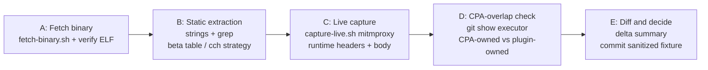

# Reverse-engineer the Claude Code CLI request fingerprint for a new CLI version

<!-- Brief introduction: what this document is about -->

## Overview
The Claude Code CLI ships as a native, un-stripped ELF binary since approximately v2.1.88 (no more `cli.js` JS bundle). Periodically — whenever Anthropic ships a new CLI version — the cc-mimicry plugin and the CLIProxyAPI (CPA) stack must stay aligned with the CLI's exact **request fingerprint**: the precise set of HTTP headers, `anthropic-beta` tokens, `user-agent` string, `x-stainless-*` headers, billing header shape, and system-prompt layout that the real CLI sends to `api.anthropic.com/v1/messages`.

This PROC is the repeatable recipe for extracting that fingerprint from any new CLI release using a combination of static binary analysis and live traffic capture. It was first executed against **v2.1.206** (2026-07-10) and all commands below are verified against that version.

**Scope:** extracting the fingerprint only. Deciding what to change in the plugin or CPA based on the delta is out of scope (see SPEC-001 and POL-001 for correctness invariants).
## Inputs and Prerequisites
**Trigger:** a new `@anthropic-ai/claude-code` npm version is published and the team needs to verify the fingerprint has not drifted.

**Checklist:**

- Node.js >= 22 installed (verified: v24.15.0) — required for `node --experimental-strip-types`
- `npm` available — used only for `npm view` registry queries
- `strings` (GNU binutils), `file`, `python3`, `pgrep`, `ss` available on PATH
- Live OAuth access token (`sk-ant-oat01-…`) obtained from CPA container `/root/.cli-proxy-api/*.json` (pick one with `expired` > now and high tier e.g. `max_20x`)
- `CLAUDE_CODE_OAUTH_TOKEN` exported in the shell
- Repo scripts present: `scripts/recon/fetch-binary.sh`, `scripts/recon/capture-live.sh`, `scripts/recon/flow-to-fixture.py`, `scripts/recon/check-binary.sh`, `scripts/recon/extract-cch.ts`, `scripts/recon/xxhash64.ts`
- Working directory is `/home/arkptz/git/mine/cc-mimicry`

**Obtaining the OAuth token from the CPA container:**

```bash
docker exec -it clauberus-cliproxy_cliproxyapi_1 sh
ls /root/.cli-proxy-api/*.json
# Pick a non-expired, high-tier token:
cat /root/.cli-proxy-api/<file>.json | python3 -c \
  "import sys,json; d=json.load(sys.stdin); print(d['access_token'], d['expired'])"
```

**Required repo files (scripts/recon/):**

| File | Purpose |
|---|---|
| `scripts/recon/fetch-binary.sh` | Downloads the per-platform CLI package, verifies its npm sha512, unpacks the ELF. |
| `scripts/recon/capture-live.sh` | The primary capture tool: mitmproxy reverse proxy + CLI driver, one fixture per surface. |
| `scripts/recon/flow-to-fixture.py` | Converts a mitmproxy flow into a redacted `testdata/captures` fixture. |
| `scripts/recon/check-binary.sh` | Quick ELF sanity check. |
| `scripts/recon/capture.ts` | Legacy Node proxy (port 18899), superseded by `capture-live.sh`. |
| `scripts/recon/intercept-claude.ts` | Legacy intercept helper (retained for reference). |
| `scripts/recon/extract-cch.ts` | Extracts cch-related strings from ELF (legacy — cch is now a static placeholder). |
| `scripts/recon/xxhash64.ts` | xxHash64 port (legacy — kept in case Anthropic re-enables dynamic cch). |
## Outputs
At the end of this process the operator has:

| Artifact | Location | Description |
|---|---|---|
| Sanitized capture fixture | `testdata/captures/v<VER>/<surface>-body.json` | On-the-wire POST /v1/messages dump with all headers and body; secrets stripped. |
| Static strings excerpt | `/tmp/cc-strings.txt` (ephemeral) | Full `strings -n 6` output from the ELF; not committed. |
| Delta summary | Mental note / ticket | List of fields that changed vs the previous version, scoped to fields the plugin or CPA actually control. |

**Definition of done:**

1. `testdata/captures/v<VER>/<surface>-body.json` exists for both surfaces and passes the secret-sanity grep (zero hits for token, device_id, session_id).
2. The operator can state for each fingerprint field: its current value, whether it is static or runtime-computed, and which layer (plugin vs CPA executor) owns it on the wire.
3. No `mitmdump` process from the capture run is left listening.
## Roles and Responsibilities
| Role | Responsibility | Owner |
|---|---|---|
| Operator (R) | Executes Steps A–E; produces and commits the sanitized fixture; writes the delta summary. | @arkptz |
| Reviewer (C) | Spot-checks the fixture for completeness and secret hygiene before merge. | @arkptz |
| Plugin maintainer (I) | Receives delta summary and decides whether plugin constants need updating (per SPEC-001 / POL-001). | @arkptz |

R = Responsible, C = Consulted, I = Informed.
## Process Flow


Five sequential stages; each has a clear pass/fail gate before proceeding to the next.
## Steps
1. **Step A — Fetch the Binary.** Download the official platform tarball and confirm it is an un-stripped ELF.

   ```bash
   npm view @anthropic-ai/claude-code dist-tags
   # Example: { latest: '2.1.268', ... }

   VER=2.1.268   # set to the version you want to recon

   # Downloads the per-platform package, verifies its npm sha512, and unpacks
   # to _work/claude-$VER/claude.
   scripts/recon/fetch-binary.sh "$VER"
   CLAUDE_BIN="_work/claude-${VER}/claude"
   ```

   The wrapper package `@anthropic-ai/claude-code` no longer contains a binary:
   since 2.1.x it ships `install.cjs` plus a stub, and the native executable
   lives in `@anthropic-ai/claude-code-linux-x64` (an optionalDependency).

   **Gate:** `file` says "not stripped"; `--version` matches `$VER`.

2. **Step B — Static Extraction** (source of truth for fixed fingerprint fields).

   ```bash
   strings -n 6 "$CLAUDE_BIN" > /tmp/cc-strings.txt

   grep -i "billing" /tmp/cc-strings.txt
   # Look for: x-anthropic-billing-header
   # Value template: cc_version=…; cc_entrypoint=…; cch=…

   grep -i "cch=" /tmp/cc-strings.txt | head -20
   # v2.1.206: cch=00000  ← STATIC placeholder, NOT recomputed at runtime

   # (Conditional) Dynamic cch detection — only if cch is NOT 00000:
   grep -E "6e52736ac806831e|59cf53e54c78|padStart|0xfffff" /tmp/cc-strings.txt
   # seed, salt, padding, mask from old xxHash64. If found → port xxhash64.ts.

   grep -E "claude-cli/" /tmp/cc-strings.txt
   # Expected: claude-cli/${VERSION} (external, sdk-cli)

   grep "anthropic-version" /tmp/cc-strings.txt    # Expected: 2023-06-01
   grep '"x-app"' /tmp/cc-strings.txt              # Expected: cli
   grep "x-stainless-package-version" /tmp/cc-strings.txt

   # Full beta-token table
   grep -aoE '"[a-z][a-z0-9-]*-202[0-9]-[0-9]{2}-[0-9]{2}"' /tmp/cc-strings.txt | sort -u
   # v2.1.206 expected (9 tokens):
   #   "advisor-tool-2026-03-01"         "claude-code-20250219"
   #   "context-management-2025-06-27"   "effort-2025-11-24"
   #   "interleaved-thinking-2025-05-14" "mid-conversation-system-2026-04-07"
   #   "prompt-caching-scope-2026-01-05" "structured-outputs-2025-12-15"
   #   "thinking-token-count-2026-05-13"
   ```

   **KEY LEARNING (v2.1.206):** `cch` is a **static `cch=00000` placeholder** — the old xxHash64+seed+salt machinery is dead/legacy. No crypto port needed unless the conditional grep above shows activity.

   **Gate:** billing header key found; beta token list non-empty; cch strategy determined.

3. **Step C — Live Capture** (runtime-computed values + on-the-wire truth).

   ```bash
   # Runs mitmproxy in reverse-proxy mode in front of the upstream, drives the
   # CLI through it, and writes redacted fixtures for both surfaces.
   scripts/recon/capture-live.sh --version "$VER" --surface both
   # Non-default upstream (e.g. a relay): --upstream https://host[/prefix]
   ```

   The surface is decided by how the CLI is driven, not by an env var: `-p`
   (print) always reports `cc_entrypoint=sdk-cli`, so the `cli` surface is
   captured by driving the TUI through a pty. The script does both and refuses
   to write a fixture whose `cc_entrypoint` disagrees with `--surface`.

   **GOTCHA — capture environment leaks into the beta set:** tokens gated on the
   auth mode (`oauth-*`) or on account entitlements are absent when capturing
   through a relay or an API key. Treat the capture's `anthropic-beta` as a
   subset, and confirm the full set against the binary's strings (Step B).

   **GOTCHA — `cch` only appears for firstParty auth:** the CLI emits
   ` cch=00000;` only when the account is firstParty (or vertex), so a relay
   capture has no `cch` segment at all. The plugin still emits the placeholder,
   which CPA rewrites downstream.

   **GOTCHA — title-generation sidecar:** CLI sends a secondary request with a dummy `x-api-key` → 401 from api.anthropic.com. Primary fingerprint is still fully captured; the 401 is expected and harmless.

   **GOTCHA — CPA pipeline order** (fields the plugin CANNOT control):
   ```
   DD-model-decode → plugin intercept_before → CPA executor transforms:
       beta header merge/override   ← OVERWRITES plugin-set Anthropic-Beta
       User-Agent override          ← OVERWRITES plugin-set User-Agent
       x-app override               ← OVERWRITES plugin-set x-app
       anthropic-version override   ← OVERWRITES plugin-set anthropic-version
       cch signing (no-op: cch=00000)
   ```

   **Verify the redaction:** the fixture only carries `ua`, `betas` and the
   system blocks, and `capture-live.sh` refuses to write one containing the
   request's credential values. Confirm independently before committing:
   ```bash
   grep -c "sk-ant-\|device_id" testdata/captures/v${VER}/*-body.json   # must be 0
   ```
   Note that the system prompt itself contains the words "authorization" and
   "Bearer", so grepping for header *names* gives false positives.

   **Gate:** fixture exists; `user-agent`, `anthropic-beta`, billing header non-empty; secret grep counts = 0.

4. **Step D — CPA-Overlap Check** (avoids patching dead code). Determine which fingerprint fields CPA's executor already hardcodes and overwrites.

   ```bash
   CPA_DIR=/path/to/cliproxyapi
   EXECUTOR=internal/runtime/executor/claude_executor.go

   # Option 1: local checkout
   grep -n "applyClaudeHeaders\|baseBetas\|Header.Set\|Anthropic-Beta\|User-Agent\|x-app\|anthropic-version\|x-stainless" \
     "${CPA_DIR}/${EXECUTOR}" | head -60

   # Option 2: specific tag from git history
   git -C "$CPA_DIR" show "v0.9.x:${EXECUTOR}" | \
     grep -n "applyClaudeHeaders\|baseBetas\|Header.Set" | head -60
   ```

   Look for `applyClaudeHeaders` (~lines 1050–1170 in v0.9.x). `baseBetas` string literal + `Header.Set("Anthropic-Beta", …)` prove CPA clobbers the header. Record **CPA-owned** vs **plugin-owned** fields.

   **Gate:** every field from Steps B/C categorized as CPA-owned or plugin-owned.

5. **Step E — Diff and Decide.** Produce a concise delta summary.

   ```bash
   PREV=testdata/captures/v<PREV_VER>/cli-body.json
   NEW=testdata/captures/v${VER}/cli-body.json

   python3 -c "
   import json
   with open('$PREV') as f: prev = json.load(f)
   with open('$NEW')  as f: new  = json.load(f)
   pb = set((prev.get('betas') or '').split(',')); nb = set((new.get('betas') or '').split(','))
   print('Added:',   nb - pb)
   print('Removed:', pb - nb)
   if prev.get('ua') != new.get('ua'):
       print(f\"UA changed: {prev.get('ua')!r} -> {new.get('ua')!r}\")
   print('block count:', len(prev['system_blocks']), '->', len(new['system_blocks']))
   "
   ```

   For each delta: (a) CPA-owned → note but no plugin action; (b) check SPEC-001/POL-001 coverage; (c) open ticket only for plugin-owned fields that actually changed. Commit the fixture.

6. **QA / Verification Checklist** — run after all steps:

   ```bash
   file "$CLAUDE_BIN" | grep -q "not stripped" && echo "OK" || echo "WARN: stripped"
   "$CLAUDE_BIN" --version | grep -q "$VER" && echo "OK" || echo "FAIL: version mismatch"

   python3 -c "
   import json, sys
   for surface in ('cli', 'sdk-cli'):
       with open(f'testdata/captures/v${VER}/{surface}-body.json') as f: d = json.load(f)
       assert d.get('ua'), f'{surface}: missing ua'
       assert d.get('betas'), f'{surface}: missing betas'
       assert d['system_blocks'], f'{surface}: no system blocks'
       assert f'cc_entrypoint={surface};' in d['system_blocks'][0]['text'], f'{surface}: wrong entrypoint'
   print('OK: fixtures complete')
   "

   grep -c 'sk-ant-\|device_id' testdata/captures/v${VER}/*-body.json   # must be 0
   pgrep -af mitmdump || echo "OK: no mitmdump procs"
   go test -race ./...
   ```

7. **Appendix — Known Values as of v2.1.268** (baseline for future diffs; update each run):

   | Field | Value | Static/Runtime | Owned by |
   |---|---|---|---|
   | `user-agent` | `claude-cli/2.1.268 (external, sdk-cli)` | Runtime (version substituted) | CPA executor |
   | `x-stainless-package-version` | `0.94.0` | Static | CPA executor |
   | `anthropic-version` | `2023-06-01` | Static | CPA executor |
   | `x-app` | `cli` | Static | CPA executor |
   | `x-anthropic-billing-header` | `cc_version=2.1.268.<buildhash>; cc_entrypoint=<surface>;` | Runtime (`cch=` only for firstParty/vertex auth) | CPA executor |
   | `cch` component | `cch=00000` (static placeholder, NOT recomputed) | Static | CPA executor |

   System prompt layout changed in 2.1.268: the array is **3 blocks**, not 4.
   The former `system[3]` (`# Text output …`) is now part of the intro block,
   and `cache_control` is a bare `{"type":"ephemeral"}` on blocks 1 and 2 — the
   `ttl: 1h` / `scope: global` qualifiers of 2.1.206 are gone. Optional billing
   segments seen in the binary: `cc_workload`, `cc_is_subagent`, `cc_prev_req`,
   `cc_prompt_id`.

   On-the-wire `anthropic-beta` tokens (9 total, all CPA-owned via `applyClaudeHeaders`):
   `claude-code-20250219`, `interleaved-thinking-2025-05-14`, `thinking-token-count-2026-05-13`, `context-management-2025-06-27`, `prompt-caching-scope-2026-01-05`, `mid-conversation-system-2026-04-07`, `advisor-tool-2026-03-01`, `effort-2025-11-24`, `structured-outputs-2025-12-15`.
## Exceptions and Escalation
| Condition | Symptom | Resolution |
|---|---|---|
| Binary is stripped | `file` output contains "stripped" instead of "not stripped" | Static extraction still works for string literals; symbol names absent. Note in delta summary. No escalation needed. |
| `cch` is no longer a static placeholder | Step B grep shows `6e52736ac806831e` / `59cf53e54c78` alongside a non-`00000` cch template | Port `scripts/recon/xxhash64.ts` logic; test against a live capture. Update this PROC's appendix. |
| capture-live.sh exits with no fixture | No file at `testdata/captures/v<VER>/<surface>-body.json` | Inspect `_work/capture-<VER>/<surface>-{cli,mitm}.log`. A fresh workspace shows a "do you trust this folder?" prompt that swallows the typed prompt; the script answers it, but a changed dialog would break that again. |
| Fixture rejected for wrong entrypoint | `captured cc_entrypoint=… but --surface=…` | The CLI was driven in the wrong mode. `-p` is always sdk-cli; the cli surface needs the pty-driven TUI path. |
| All requests get 401 | Fixture has `status: 401` in every captured request | The OAuth token has expired. Re-obtain from CPA container (see Prerequisites). The fingerprint headers are still visible in the 401 request — capture is still valid for header extraction. |
| CPA source not available locally | No CPA git checkout for Step D | Use `git -C <cpa-dir> show <tag>:internal/runtime/executor/claude_executor.go` against a cached remote, or check the `.cpa-version` / `.cpa-commit` pinned in this repo and fetch that commit from the upstream CPA remote. |
| Port 18899 already in use | `capture.ts` exits immediately with `EADDRINUSE` | Kill the conflicting process: `fuser -k 18899/tcp`, then retry. |
| New beta token found that is not in SPEC-001 | Step E diff shows a new `*-202X-*` token | Add to the appendix of this PROC; open a ticket to update SPEC-001's beta invariant list and POL-001 if it introduces a new correctness constraint. |
## Metrics
| Metric | Target | Notes |
|---|---|---|
| Time to complete Steps A–E | < 30 min per CLI version | From `npm view` to committed sanitized fixture. Assumes token already obtained. |
| Secret-hygiene pass rate | 100% | Zero fixtures committed with live tokens, device_id, or session_id. |
| Coverage of fingerprint fields | 100% | Every field in the on-the-wire request must be categorized (static/runtime, plugin-owned/CPA-owned) before the process is considered done. |
| Lag from CLI release to recon completion | < 7 days | Run this process within one week of a new `@anthropic-ai/claude-code` npm publish. |
## Revision History
| Date | Author | Changes |
|---|---|---|
| 2026-07-10 | @arkptz | Initial version. Verified against CLI v2.1.206. Documents Steps A–E, CPA-overlap check, cch=static finding, pipeline order gotcha, and known values appendix. |
| 2026-09-11 | @arkptz | Re-run against CLI v2.1.268. Step A now uses `scripts/recon/fetch-binary.sh` (the wrapper npm package no longer ships a binary); Step C uses `scripts/recon/capture-live.sh` (mitmproxy reverse proxy, pty for the cli surface). Records the 4→3 system-block change, the dropped cache_control ttl/scope, and the firstParty-only `cch`. |